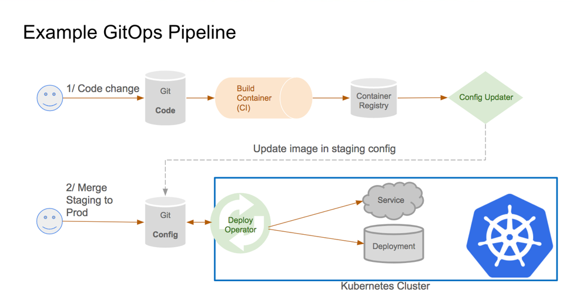
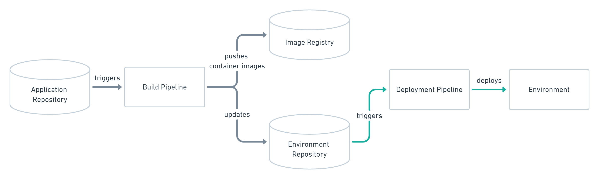
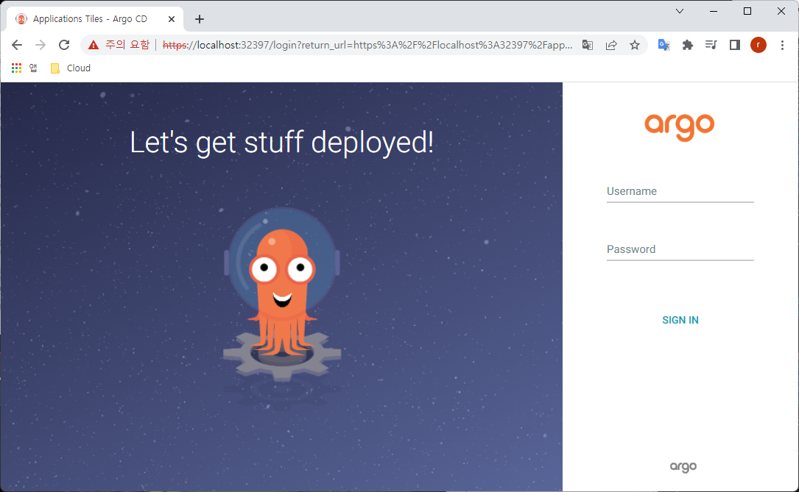

# < 3교시: ArgoCD >


# 1. GitOps

## 1) GitOps 개요

개발자와 운영자의 소통, 협업, 통합을 강조하는 DevOps는 많이들 들어봤을 것이다.

GitOps는 DevOps의 실천 방법 중 하나로 애플리케이션의 배포와 운영에 관련된 모든 요소들을 Git에서 관리(Operation) 한다는 의미이다.

[](https://github.com/ssongman/edu/blob/master/assets/gitops_overview.png)

아주 간단하게 말해서 GitOps는 Kubernetes Manifest파일을 Git에서 관리하고, 배포할때에도 Git에 저장된 Manifest로 클러스터에 배포하는 일련의 과정들을 의미한다.


## 2) GitOps 원칙

- 모든 시스템은 선언적으로 선언되어야 함
  “선언적(declarative)”이라 함은 명령들의 집합이 아니라 사실(fact)들의 집합으로 구성이 되었음을 보장한다는 의미이다. 쿠버네티스의 manifest들은 모두 선언적으로 작성되었고 이를 Git으로 관리한다면 versioning과 같은 Git의 장점과 더불어, SSOT(single source of truth)를 소유하게 된다.
- 시스템의 상태는 Git의 버전을 따라감
  Git에 저장된 쿠버네티스 manifest를 기준으로 시스템에 배포되기 때문에 이전 버전의 시스템을 배포하고싶으면 git revert와 같은 명령어를 사용하면 된다.
- 승인된 변화는 자동으로 시스템에 적용됨
  한 번 선언된 manifest가 Git에 등록되고 관리되기 시작하면 변화(코드수정 등)가 발생할때마다 자동으로 시스템에 적용되어야 하며, 클러스터에 배포할때마다 자격증명은 필요하지 않아야 한다.
- 배포에 실패하면 이를 사용자에게 경고해야 함
  시스템 상태가 선언되고 버전 제어 하에 유지되었을 때 배포가 실패하게되면 사용자에게 경고할 수 있는 시스템을 마련해야 한다.


## 3) GitOps Repository

GitOps Pipeline을 설계할때에는 Git Repository를 최소 두개이상 사용하는 것을 권장한다.

[](https://github.com/ssongman/edu/blob/master/assets/gitops_pipeline.png)

- App Repo : App 소스코드와, 배포를 위한 Manifest 파일
- 배포환경 구성용 Repo : 배포 환경에 대한 모든 Manifest (모니터링, 서비스, MQ 등)들이 어떤 버전으로 어떻게 구성되어 있는지 포함


## 4) GitOps 배포 전략

두가지 방법이 있다.

- Push Type
  Git Repo가 변경되었을 때 파이프라인을 실행시키는 구조이다.

  

  배포 환경의 개수에 영향을 받지 않으며 접속 정보를 추가하거나 수정하는 것만으로도 간단하게 배포 환경을 추가하거나 변경할 수 있다.
  아키텍처가 쉬워 많은 곳에서 사용하고 있으나, 보안정보가 외부로 노출될 수 있다는 단점이 있다.

- Pull Type
  배포하려는 클러스터에 위치한 별도의 오퍼레이터가 배포역할을 대신한다.

  

  해당 오퍼레이터는 Git Repo의 Manifest와 배포환경을 지속적으로 비교하다가 차이가 발생할 경우, Git Repo의 Manifest를 기준으로 클러스터를 유지시켜 준다.

  또한 Push Type과 달리 오퍼레이터가 App과 동일한 환경에서 동작중이므로 보안 정보가 외부에 노출되지 않고 실행할 수 있다.


# 2. ArgoCD

## 1) ArgoCD 개요

한마디로 쿠버네티스를 위한 CD(Continuous Delivery)툴이다.

GitOps방식으로 관리되는 Manifest 파일의 변경사항을 감시하며, 현재 배포된 환경의 상태와 Git에 정의된 Manifest 상태를 동일하게 유지하는 역할을 수행 한다.

push타입과 pull타입 모두를 지원하며 pull타입 배포를 권장한다.

[](https://github.com/ssongman/edu/blob/master/assets/argocd_mark.png)

ArgoCD는 GitOps를 실현시키며 쿠버네티스에 배포까지 해주는 툴이다.


# 3. 실습(개인PC)


## 1) ArgoCD 설치


### (1) Create namespace

argocd 설치를 위한 namespace를 생성한다.

```sh
$ kubectl create namespace argocd
```


### (2) ArgoCD install

```sh
$ kubectl apply -n argocd -f \
    https://raw.githubusercontent.com/argoproj/argo-cd/stable/manifests/install.yaml

$ alias ka='kubectl -n argocd'

$ ka get pod -w


$ ka get pod
NAME                                                READY   STATUS    RESTARTS   AGE
argocd-redis-79bdbdf78f-sg8vr                       1/1     Running   0          5m47s
argocd-applicationset-controller-79f97597cb-n876k   1/1     Running   0          5m47s
argocd-notifications-controller-855df7bb69-rgthm    1/1     Running   0          5m47s
argocd-application-controller-0                     1/1     Running   0          5m47s
argocd-repo-server-6864955749-jrvkv                 1/1     Running   0          5m47s
argocd-server-795d56944c-ld9jd                      1/1     Running   0          5m47s
argocd-dex-server-fd9588cbc-4wj2t                   1/1     Running   0          5m47s


$ ka get svc
NAME                                      TYPE        CLUSTER-IP      EXTERNAL-IP   PORT(S)                      AGE
argocd-applicationset-controller          ClusterIP   10.43.214.14    <none>        7000/TCP                     8m5s
argocd-dex-server                         ClusterIP   10.43.237.245   <none>        5556/TCP,5557/TCP,5558/TCP   8m5s
argocd-metrics                            ClusterIP   10.43.8.174     <none>        8082/TCP                     8m5s
argocd-notifications-controller-metrics   ClusterIP   10.43.218.128   <none>        9001/TCP                     8m5s
argocd-redis                              ClusterIP   10.43.218.182   <none>        6379/TCP                     8m5s
argocd-repo-server                        ClusterIP   10.43.117.73    <none>        8081/TCP,8084/TCP            8m5s
argocd-server                             ClusterIP   10.43.205.134   <none>        80/TCP,443/TCP               8m5s
argocd-server-metrics                     ClusterIP   10.43.125.160   <none>        8083/TCP                     8m5s

```


- tls disable 처리
  - deployment 에서 command parameter 로 --insecure 처리

```sh
$ ka get deploy argocd-server -o yaml

apiVersion: apps/v1
kind: Deployment
metadata:
  name: argocd-server
  namespace: argocd
...
spec:
  template:
    metadata:
    spec:
      containers:
      - command:
        - argocd-server
        - --insecure             <--- 삽입
        env:
...
```


### (3) Service Expose

기본적으로 Argo CD API 서버는 외부 IP로 노출되지 않는다. API 서버에 액세스하려면 다음 중 하나를 선택하여 Argo CD API 서버를 노출시킨다.

```
1) Service Type Load Balancer
2) Ingress
3) Port Forwarding
4) node port
```

이중 ingress / node port 방식을 알아보자.


- ingress 방식

```sh

$ ka apply -f - <<EOF
apiVersion: networking.k8s.io/v1
kind: Ingress
metadata:
  name: argocd-ingress
  annotations:
    kubernetes.io/ingress.class: "traefik"
spec:
  rules:
  - host: "argocd.ktcloud.211.254.212.105.nip.io"
    http:
      paths:
      - path: /
        pathType: Prefix
        backend:
          service:
            name: argocd-server
            port:
              name: http
EOF


## 확인
$ curl http://argocd.ktcloud.211.254.212.105.nip.io/

```


- nodePort 방식
  - service 를 ClusterIP type 에서 NodePort type 으로 변경


```sh

$ ka edit svc argocd-server
…
spec:
  ...
  ports:
    ...
  selector:
    app.kubernetes.io/name: argocd-server
  type: ClusterIP                           <- ClusterIP --> NodePort 로 변경


$ ka get svc
NAME                                      TYPE        CLUSTER-IP      EXTERNAL-IP   PORT(S)                      AGE
argocd-applicationset-controller          ClusterIP   10.43.202.220   <none>        7000/TCP                     12h
argocd-dex-server                         ClusterIP   10.43.226.53    <none>        5556/TCP,5557/TCP,5558/TCP   12h
argocd-metrics                            ClusterIP   10.43.62.76     <none>        8082/TCP                     12h
argocd-notifications-controller-metrics   ClusterIP   10.43.136.143   <none>        9001/TCP                     12h
argocd-redis                              ClusterIP   10.43.160.138   <none>        6379/TCP                     12h
argocd-repo-server                        ClusterIP   10.43.53.80     <none>        8081/TCP,8084/TCP            12h
argocd-server                             NodePort    10.43.18.82     <none>        80:30083/TCP,443:30121/TCP   12h
argocd-server-metrics                     ClusterIP   10.43.228.225   <none>        8083/TCP                     12h


## 확인
$ curl localhost:30083/ -H "Host:argocd.ktcloud.211.254.212.105.nip.io"

```

30083 node port 가 생성되었다.


### (4) ArgoCD-ui 접근

http://localhost:30083

http://argocd.ktcloud.211.254.212.105.nip.io/




### (5) Password 확인
확인Argo CD는 최초 admin account의 초기 password를 kubernetes 의 secret 으로 저장해 놓는다. 아래와 같이 password를 얻는다.

```sh
# 1) jsonpath 방식 
$ ka get secret argocd-initial-admin-secret -o jsonpath="{.data.password}" | base64 -d; echo

C7TBBBRxh4LcG28m


# 2) yaml 방식
$ ka -n argocd get secret argocd-initial-admin-secret -o yaml
apiVersion: v1
data:
  password: QzdUQkJCUnhoNExjRzI4bQ==
kind: Secret
metadata:
  creationTimestamp: "2022-06-09T01:54:43Z"
  name: argocd-initial-admin-secret
  namespace: argocd
  resourceVersion: "329780"
  uid: 1166305f-eb12-4312-83ec-5812547af738
type: Opaque


$ echo QzdUQkJCUnhoNExjRzI4bQ== | base64 --decode
C7TBBBRxh4LcG28m
```


### (6) login

admin / C7TBBBRxh4LcG28m


### (7) clean up

```sh
$ kubectl -n argocd delete -f \
    https://raw.githubusercontent.com/argoproj/argo-cd/stable/manifests/install.yaml
```


## 2) CLI 설치

### (1) Download CLI

Argo CD CLI 설치 한다.
최종버젼 release : https://github.com/argoproj/argo-cd/releases/latest

```sh
$ wget https://github.com/argoproj/argo-cd/releases/download/v2.3.4/argocd-linux-amd64

$ chmod +x argocd-linux-amd64

$ mv ./argocd-linux-amd64 /usr/local/bin/argocd

```


### (2) ArgoCD Login

```sh
$ argocd login localhost:30083

or

$ argocd login http://argocd.ktcloud.211.254.212.105.nip.io/
Username: admin
Password:
'admin:login' logged in successfully
Context 'localhost:32429' updated


$ argocd cluster list
SERVER                          NAME        VERSION  STATUS      MESSAGE  PROJECT
https://kubernetes.default.svc  in-cluster  1.23     Successful

```


### (3) Password 변경

```sh
# password 변경
# 양식
argocd account update-password --account <new-username> --new-password <new-password>


$ argocd account update-password --account admin  --new-password argo1234!
*** Enter password of currently logged in user (admin):
Password updated
Context 'localhost:32429' updated


```


# 4. 실습(KT Cloud)


## 1) ArgoCD UI 접속


### (1) URL

http://argocd.ktcloud.211.254.212.105.nip.io/

admin / ****


## 2) Creating Apps Via UI

### (1) App 생성

- **+ New App**  버튼 클릭
- GENERAL
  - Application Name : guestbook-user01        <-- user01을 자기 NS 로 변경필요
  - Project : default
  - SYNC POLICY : Manual
- SOURCE
  - Respository URL : https://github.com/argoproj/argocd-example-apps.git
  - Revision : HEAD
  - Path : guestbook
- DESTINATION
  - cluster : https://kubernetes.default.svc
  - Namespace : user01        <-- user01을 자기 NS 로 변경필요
- Create 버튼 클릭


### (2) 확인

```sh
$ ku get pod
NAME                           READY   STATUS            RESTARTS   AGE
guestbook-ui-6b689986f-6wqfm   0/2     PodInitializing   0          21s


$ ku get svc
NAME           TYPE        CLUSTER-IP      EXTERNAL-IP   PORT(S)   AGE
guestbook-ui   ClusterIP   10.43.194.170   <none>        80/TCP    27s

```


### (3) clean up

delete 버튼을 실행으로 해당 application 을 삭제할 수 있다.


## 3) Creating Apps Via CLI 

### (1) Download CLI

root 권한으로 수행필요

```sh
$ wget https://github.com/argoproj/argo-cd/releases/download/v2.3.4/argocd-linux-amd64
$ chmod +x argocd-linux-amd64
$ mv ./argocd-linux-amd64 /usr/local/bin/argocd
```


### (2) ArgoCD Login

```sh
$ argocd login argocd.ktcloud.211.254.212.105.nip.io
Username: admin
Password:
'admin:login' logged in successfully
Context 'localhost:32429' updated


$ argocd cluster list
SERVER                          NAME        VERSION  STATUS      MESSAGE  PROJECT
https://kubernetes.default.svc  in-cluster  1.23     Successful

```


### (3) Creating Apps

- guestbook

```sh
$ argocd app create guestbook-user02 \
    --project default \
    --repo https://github.com/argoproj/argocd-example-apps.git \
    --path guestbook \
    --dest-server https://kubernetes.default.svc \
    --dest-namespace user02
```


### (4) Deploy

```sh
$ argocd app sync guestbook-user01
$ argocd app sync guestbook-user02
```


### (5) clean up

```sh
$ argocd app delete guestbook-user01
$ argocd app delete guestbook-user02
```


## 4) Creating Userlist


### (1) Creating Apps

```sh
$ argocd app create userlist-user01 \
    --project default \
    --repo https://github.com/ssongman/userlist.git \
    --path argocd/userlist \
    --dest-server https://kubernetes.default.svc \
    --dest-namespace user01
```


### (2) Deploy

```sh
$ argocd app sync guestbook-user01
$ argocd app sync guestbook-user02
```


### (3) clean up

```sh
$ argocd app delete guestbook-user01
$ argocd app delete guestbook-user02
```


## 9) rollout


```sh

$ k create namespace argo-rollouts
$ k apply -n argo-rollouts -f https://github.com/argoproj/argo-rollouts/releases/latest/download/install.yaml


```


- clean up

```sh
# clean up
$ k delete -n argo-rollouts -f https://github.com/argoproj/argo-rollouts/releases/latest/download/install.yaml

```


- Sample rollout

```sh
$ alias ku='kubectl -n user01'

# Rollout
$ ku apply -f - <<EOF
apiVersion: argoproj.io/v1alpha1
kind: Rollout
metadata:
  name: rollouts-demo
spec:
  replicas: 5
  strategy:
    canary:
      steps:
      - setWeight: 20
      - pause: {}
      - setWeight: 40
      - pause: {duration: 10}
      - setWeight: 60
      - pause: {duration: 10}
      - setWeight: 80
      - pause: {duration: 10}
  revisionHistoryLimit: 2
  selector:
    matchLabels:
      app: rollouts-demo
  template:
    metadata:
      labels:
        app: rollouts-demo
    spec:
      containers:
      - name: rollouts-demo
        image: argoproj/rollouts-demo:blue
        ports:
        - name: http
          containerPort: 8080
          protocol: TCP
        resources:
          requests:
            memory: 32Mi
            cpu: 5m
EOF


# service
$ ku apply -f - <<EOF
apiVersion: v1
kind: Service
metadata:
  name: rollouts-demo
spec:
  ports:
  - port: 80
    targetPort: http
    protocol: TCP
    name: http
  selector:
    app: rollouts-demo
EOF


$ kubectl -n argo-rollouts patch svc rollouts-demo --patch \
'{"spec": { "type": "NodePort", "ports": [ { "nodePort": 31080, "port": 80, "protocol": "TCP", "targetPort": "http", "name": "http" } ] } }'


## ingress
$ ku apply -f - <<EOF
apiVersion: networking.k8s.io/v1
kind: Ingress
metadata:
  name: argocd-rollouts-demo-ingress
  annotations:
    kubernetes.io/ingress.class: "traefik"
spec:
  rules:
  - host: "argocd-rollouts-demo.ktcloud.211.254.212.105.nip.io"
    http:
      paths:
      - path: /
        pathType: Prefix
        backend:
          service:
            name: rollouts-demo
            port:
              name: http
EOF

$ ku argo rollouts get rollout rollouts-demo


```


- clean up

```sh

# clean up
$ ku delete Rollout rollouts-demo
$ ku delete svc rollouts-demo
$ ku delete ingress argocd-rollouts-demo-ingress

```


