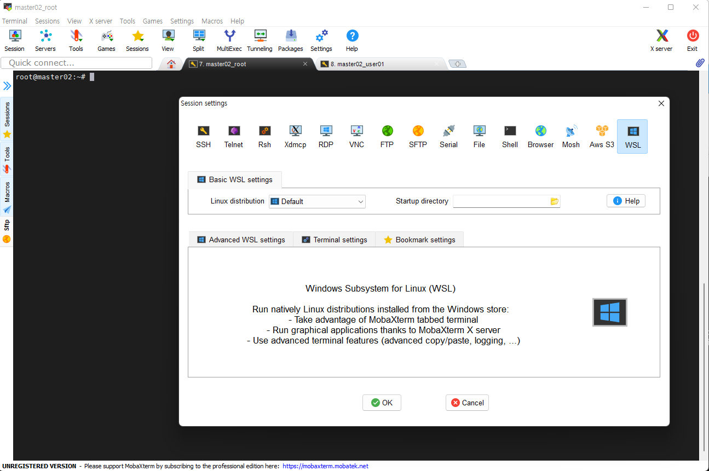
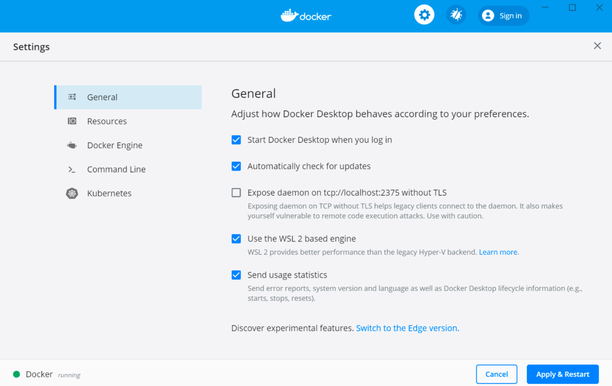
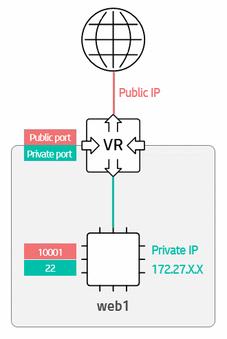

# < 시작전에 >


# 1. 실습 환경 준비(개인PC)


## 1) mobaxterm

KT cloud 서버에 ssh 접근을 위한 터미널이 필요하다. 

다양한 터미널(putty 등)이 있지만 본 실습에서는 mobax term 이라는 free 버젼 솔루션을 사용한다.

- download 위치
  - 링크: https://download.mobatek.net/2202022022680737/MobaXterm_Installer_v22.0.zip

- mobaxterm 실행


## 2) wsl 

k3s, istio, argocd 설치는 Cluster 당 한번만 가능하다. 그러므로 이러한 설치실습은 본인 PC 에 wsl 에서 진행할 예정이다.

본인 PC 에 WSL이 설치되어 있는지 확인하자.


### (1) 확인 하는 방법

command 창에서 wsl 명령으로 설치여부를 확인 할 수 있다.

```sh
> wsl -l -v 
```


- 만약 version 이 1 이라면 아래와 같이 update 한다.


```sh
> wsl --set-version Ubuntu 2

# 기본값으로 설정 변경해도 됨
> wsl --set-default-version 2

# 강제 재기동
> wsl -t Ubuntu

```


### (2) 실행하는 방법

실행하는 방법은 아래와 같이 다양하다. 본인이 편한 방법을 선택하자.

1. cmd 창에서 바로실행
   - 위 command 창에서 wsl 명령을 입력하면 바로 default linux 가 실행된다.


2. winterm 으로 실행하는 방법
   - winterm 실행
   - 위 화면과 동일

3. mobaxterm 에서 실행
   - session > WSL 실행




### (3) 교육자료 download

wsl 접속 하는데 문제가 없다면 테스트를 위해서 github 에서 교육 자료를 받아 놓자. 

```sh
## githubrepo directory 생성
$ mkdir ~/githubrepo

$ cd ~/githubrepo

$ git clone https://github.com/ssongman/ktds-edu.git
Cloning into 'ktds-edu'...
remote: Enumerating objects: 69, done.
remote: Counting objects: 100% (69/69), done.
remote: Compressing objects: 100% (55/55), done.
remote: Total 69 (delta 15), reused 62 (delta 11), pack-reused 0
Unpacking objects: 100% (69/69), 1.63 MiB | 4.09 MiB/s, done.

$ ll ~/githubrepo
total 12
drwxrwxr-x  3 song song 4096 Jun  2 13:32 ./
drwxr-xr-x 11 song song 4096 Jun  2 13:32 ../
drwxrwxr-x  5 song song 4096 Jun  2 13:32 ktds-edu/
```


## 3) docker desktop 확인

Container 와 kubernetes 의 차이를 이해하기 위해서 간단한 container 배포 테스트를 진행한다.


### (1) docker destktop 확인

우측 하단  docker desktop  아이콘에서 우클릭후 아래 그림 처럼 Docker Desktop is running 확인


### (2) docker destktop install

설치되어 있지 않으면 아래와 같이 설치한다.

- 설치 가이드 위치
  - 링크: https://docs.docker.com/desktop/windows/install/


### (3) docker daemon 확인

docker 가 실행가능 곳에서 아래와 같이 version 을 확인하자.

```sh
$ docker version
Client:
 Version:           20.10.7
 API version:       1.41
 Go version:        go1.13.8
 Git commit:        20.10.7-0ubuntu5~20.04.2
 Built:             Mon Nov  1 00:34:17 2021
 OS/Arch:           linux/amd64
 Context:           default
 Experimental:      true

Server: Docker Desktop
 Engine:
  Version:          20.10.14
  API version:      1.41 (minimum version 1.12)
  Go version:       go1.16.15
  Git commit:       87a90dc
  Built:            Thu Mar 24 01:46:14 2022
  OS/Arch:          linux/amd64
  Experimental:     false
 containerd:
  Version:          1.5.11
  GitCommit:        3df54a852345ae127d1fa3092b95168e4a88e2f8
 runc:
  Version:          1.0.3
  GitCommit:        v1.0.3-0-gf46b6ba
 docker-init:
  Version:          0.19.0
  GitCommit:        de40ad0
  
```

Server version 을 확인할 수 있다면 정상 설치되었다고 볼 수 있다.


### (4) WSL2에서 도커 데스크탑 실행 설정

도커 데스크탑을 설치하고 설정 페이지의 **General** 탭에서 **Use the WSL2 based engine** 옵션을 체크해준다.




Resource -> WSL Integration 페이지로 이동해서 설정을 확인합니다. 자신이 사용중인 WSL2 배포판이 맞는지 확인합니다.


도커 데스크탑을 설치하고 정상적으로 설정되어있다면, 바로 WSL2 우분투 터미널에서 도커 명령어를 사용할 수 있습니다.


# 2. 실습 환경 준비(KT Cloud)

## 1) KT Cloud 서버

WSL 에서의 k3s 는 한개의 노드를 사용한 초간편 Cluster이다. 하지만 Istio 모니터링과 ArgoCD 실습을 위해서는 좀더 높은 Cluster 사양이 필요하다.

원할한 실습을 위해서 KT Cloud 에 k3s, istio, argocd 등 관련 셋팅을 미리 해 놓은 상태이다.

개인별 계정과 개인별 Namespace 에서 다양한 실습을 진행할 것이다.  이를 위해 서버 접근정보를 이해하고 개인 계정을 확인하자.


### (1) KT Cloud 이해

KT Cloud에 VM 서버 하나를 생성하게 되면 다음과 같은 구조가 된다.




- vm 설명

  - 공인IP는 외부에서 접근을 할 수 있는 IP

  - 사설IP는 외부에서 접근은 못하나, 같은 서브넷 내에서 사용할 수 있는 IP
  - 외부에서 VM에 접근을 하기 위해서는 가상라우터에서 포트포워딩 작업이 필요하다.

- 가상라우터 (Virtual Router)

  - 사용자만 접근할 수 있는 서브넷과 외부의 관문(게이트웨이) 및 라우터 역할을 하는 가상 서버이다.

  - 한 계정의 한 zone에서 최초 VM을 생성하게 되면 자동으로 생성된다.

  - 기본으로 제공되어 과금이 되지 않으며, 사용자가 콘트롤 할 수 없다.

  - 하나의 공인IP가 기본으로 부여되며, 추가 공인IP를 할당할 수 있다.

- 포트포워딩

  - 가상라우터에서 외부에서 접근가능한 공인IP를 내부의 사설IP로 연결(포워딩) 해주는 작업이다.

  - 공인IP:공인 포트 <-> 사설IP:사설 포트 와 1:1 매핑이 기본이며, StaticNAT를 이용해 공인IP <-> 사설IP IP간의 매핑도 가능하다.


### (2) ssh terminal (Mobaxterm) 실행

- 메뉴 : session > SSH 

- Romote host : 211.254.212.105
- User : user01(개인별 계정)
- Port : 10022(master02),   10023(master03)
- password : 별도 통지


## 2) 수강생별 계정 매핑

| User   | Username | Server주소            | node     |
| ------ | -------- | --------------------- | -------- |
| user01 | 송양종   | 211.254.212.105:10022 | master02 |
| user02 | 송양종   | 211.254.212.105:10022 | master02 |
| user03 | 송양종   | 211.254.212.105:10022 | master02 |
| user04 | 김유석   | 211.254.212.105:10022 | master02 |
| user05 | 김자영   | 211.254.212.105:10022 | master02 |
| user06 | 류화동   | 211.254.212.105:10022 | master02 |
| user07 | 최인선   | 211.254.212.105:10022 | master02 |
| user08 | 김재혁   | 211.254.212.105:10022 | master02 |
| user09 | 안정모   | 211.254.212.105:10022 | master02 |
| user10 | 임성식   | 211.254.212.105:10022 | master02 |
| user11 | 대우석   | 211.254.212.105:10023 | master03 |
| user12 | 박기태   | 211.254.212.105:10023 | master03 |
| user13 | 신해빈   | 211.254.212.105:10023 | master03 |
| user14 | 고준호   | 211.254.212.105:10023 | master03 |
| user15 | 박규리   | 211.254.212.105:10023 | master03 |
| user16 | 이지현   | 211.254.212.105:10023 | master03 |
| user17 | 박창기   | 211.254.212.105:10023 | master03 |
| user18 | 염형필   | 211.254.212.105:10023 | master03 |
| user19 | 최민기   | 211.254.212.105:10023 | master03 |
| user20 | 홍길동   | 211.254.212.105:10023 | master03 |


## 3) 교육자료 download

본인 계정으로 접속 하였다면 테스트를 위해서 git clone 으로 교육 자료를 받아 놓자.

```sh
## githubrepo directory 생성
$ mkdir ~/githubrepo

$ cd ~/githubrepo

$ git clone https://github.com/ssongman/ktds-edu.git
Cloning into 'ktds-edu'...
remote: Enumerating objects: 69, done.
remote: Counting objects: 100% (69/69), done.
remote: Compressing objects: 100% (55/55), done.
remote: Total 69 (delta 15), reused 62 (delta 11), pack-reused 0
Unpacking objects: 100% (69/69), 1.63 MiB | 4.09 MiB/s, done.

$ ll ~/githubrepo
drwxrwxr-x  5 song song 4096 Jun  2 13:32 ktds-edu/

$ cd ~/githubrepo/ktds-edu
```

