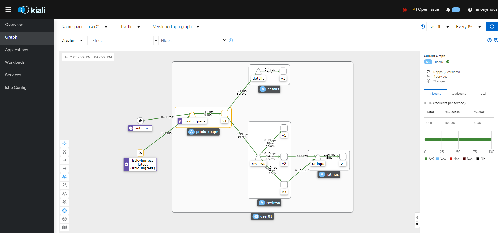
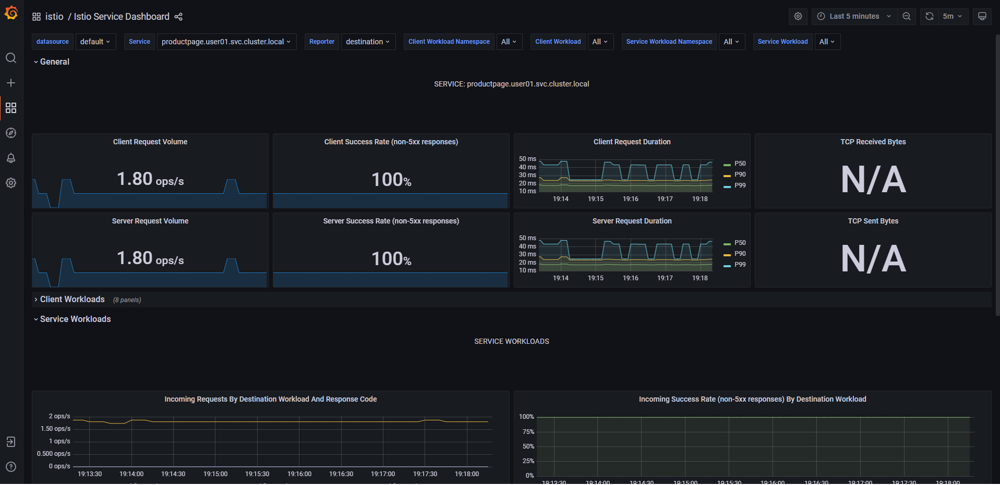

# < 2교시: Service Mesh >


# 1. Service Mesh

## 1) 서비스메쉬란?

서비스 메시는 서비스간의 통신을 제어하고 표시하고 관리할 수 있도록 하는데 특화된 마이크로 서비스를 위한 인프라 계층에 존재하는 방식이다. 기존의 서비스아키텍처의 호출이 직접 호출 방식이었다면, 서비스 메시에서느이 호출은 인프라계층의 proxy 를 통해 이뤄진다.

서비스 메시를 구성하는 개벌 proxy 는 서비스 내부가 아니라 각 서비스와 함께 실행되므로 sidecar 라고 부르기도 한다.

각 서비스에 inject 된 이러한 sidecarproxy 들이 모여 서 Mesh Network 를 형성한다.


### (2) 서비스메쉬 특징

- MicroService Architecture를 적용한 시스템의 내부 통신이 Mesh 네트워크의 형태를 띄는 것에 빗대어 Service Mesh로 명명됨

- Service Mesh 는 서비스 간 통신을 추상화하여 안전하고, 빠르고, 신뢰할 수 있게 만드는 전용 InfraStructure Layer임
- 추상화를 통해 복잡한 내부 네트워크를 제어하고, 추적하고, 내부 네트워크 관련 로직을 추가함으로써 안정성, 신뢰성, 탄력성, 표준화, 가시성, 보안성 등을 확보함

- Service Mesh 의 구현체인 경량화 Proxy를 통해 다양한 Routing Rules, circuit breaker 등 공통기능을 설정할 수 있음

- A/B 테스트, 카나리아 배포, 속도 제한, 액세스 제어, 암호화 및 종단 간 인증과 같은 보다 복잡한 운영 요구 사항도 해결할 수 있음.


### (3) 서비스 메쉬 주요기능

- 요청 라우팅 제어
- 서킷브레이커
- 로드발란싱(부하분산알고리즘)
- 보안기능(TLS, 암호화, 인증 및 권한 부여)
- 서비스간 계층에서 metric 제공


# 2. Istio

서비스메시를 구현할 수 여러 구현체는 Istio, linked, conduit, AWS App Mesh 등이 존재한다. 그중 Istio 에 대해서 알아보자.


## 1) Istio 란?

Istio는 기존 분산 애플리케이션에 투명하게 계층화되는 오픈 소스 서비스 메시이다.  Istio는 간단한 설정만으로 서비스를 보호, 연결 및 모니터링하는 강력한 기능을 제공한다. 

Istio는 서비스 코드 변경이 거의 또는 전혀 없이 로드 밸런싱, 서비스 간 인증 및 모니터링 기능을 제공한다. 

강력한 컨트롤 플레인은 다음과 같은 중요한 기능을 제공한다.

- TLS 암호화, 강력한 ID 기반 인증 및 권한 부여를 통해 클러스터에서 안전한 서비스 간 통신
- HTTP, gRPC, WebSocket 및 TCP 트래픽에 대한 자동 로드 밸런싱
- Routing rule, retry, retries, failovers 및 복원력 테스트를위한 Fault Injection 등을 통해 트래픽 동작을 세밀하게 제어
- 액세스 제어, 속도 제한 및 할당량을 지원하는 플러그형 정책 레이어 및 구성 API
- 클러스터 수신 및 송신을 포함하여 클러스터 내의 모든 트래픽에 대한 자동 메트릭, 로그 및 추적


## 2) istio 사용전후

- Istio 사용전


- Istio 사용후


### Istio 서비스 메시의 이점

##### 일관된 서비스 네트워킹 달성

네트워킹 운영자는 개발자 오버헤드를 추가하지 않고도 모든 서비스의 네트워킹을 일관성 있게 관리할 수 있습니다.


##### Istio 이점을 통한 서비스 보호

보안 운영자는 인증, 승인, 암호화를 비롯한 서비스 간 보안을 쉽게 구현할 수 있습니다.


##### 애플리케이션 성능 향상

카나리아 롤아웃과 같은 권장사항을 구현하고 애플리케이션을 심도 있게 파악하여 성능을 개선하기 위해 집중해야 하는 부분을 파악할 수 있습니다.


##### 안전한 클라우드 기반 앱

강력한 ID 기반 인증, 승인, 암호화를 통해 애플리케이션 수준에서 보안을 강화할 수 있습니다.


##### 효율적인 트래픽 관리

다양한 라우팅 규칙, 재시도, 장애 조치, 결함 주입으로 트래픽 동작을 세밀하게 제어할 수 있습니다.


##### 서비스 메시 모니터링

Istio의 강력한 추적, 모니터링, 로깅 기능으로 서비스 성능이 업스트림에 미치는 영향을 자세히 파악할 수 있습니다.


##### Kubernetes 및 가상 머신을 통한 간편한 배포

Istio는 컨테이너 및 가상 머신을 포함한 기존 워크로드와 최신 워크로드 모두에 대해 가시성과 네트워크 제어를 제공합니다.


##### 고급 기능으로 부하 분산 간소화

클라이언트 기반 라우팅, 카나리아 롤아웃과 같은 고급 기능과 함께 모든 트래픽에 자동화된 부하 분산을 사용할 수 있습니다.


##### 정책 시행

액세스 제어, 비율 제한, 할당량을 지원하는 플러그인 가능한 정책 레이어 및 구성 API를 사용하여 정책을 시행할 수 있습니다.


## 3) Istio 주요 기능


### (1) Traffic management

Istio의 트래픽 라우팅 규칙을 사용하면 서비스 간의 트래픽 흐름 및 API 호출을 쉽게 제어할 수 있다.

Istio는 circuit breakers, timeouts, and retries 와 같은 서비스 수준의 속성을 쉽게 구성할 수 있다.

A/B testing, canary 베포 및 백분율 기반 트래픽 분할을 통한 단계적 출시와 같은 중요한 작업을 쉽게 설정할 수 있다.


### (2) Observability

서비스가 복잡해짐에 따라 동작과 성능을 이해하는 것이 어려워진다. 

Istio는 서비스 메시 내의 모든 통신에 대한 상세한 원격 metric을 생성하여

이 원격 측정은 서비스 동작의 관찰 가능성을 제공하여 운영자가 문제를 해결하고 애플리케이션을 유지 관리하고 최적화할 수 있도록 합니다. 더군다나 애플리케이션을 변경할 필요 없이 이 계측을 거의 모두 사용할 수 있습니다. 운영자는 Istio를 통해 모니터링되는 서비스가 상호 작용하는 방식을 철저히 이해할 수 있습니다.

Istio의 원격 측정에는 자세한 메트릭, 분산 추적 및 전체 액세스 로그가 포함됩니다. 

Istio를 사용하면 전체적인 서비스 메시 Observability 이점을 을 얻을 수 있습니다.


### (3) Security capabilities

마이크로서비스는 메시지 가로채기(man-in-the-middle) 공격에 대한 보호, 유연한 액세스 제어, 감사 도구 및 상호 TLS를 비롯한 특정 보안 요구 사항이 있습니다. 

Istio에는 운영자가 이러한 모든 문제를 해결할 수 있는 포괄적인 보안 솔루션이 포함되어 있습니다. 

강력한 ID, 강력한 정책, 투명한 TLS 암호화, AAA(인증, 권한 부여 및 감사) 도구를 제공하여 서비스와 데이터를 보호합니다.

Istio의 보안 모델은 기본 보안을 기반으로 하며, 신뢰할 수 없는 네트워크에서도 보안 중심 애플리케이션을 배포할 수 있도록 심층 방어를 제공하는 것을 목표로 합니다.


# 3. Istio 실습(개인PC)


## 1) helm 설치

쿠버네티스에 서비스를 배포하는 방법이 다양하게 존재하는데 그중 대표적인 방법중에 하나가 Helm chart 방식 이다.


- helm chart 의 필요성

일반적으로 Kubernetes 에 서비스를 배포하기 위해 준비되는 Manifest 파일은 정적인 형태이다. 따라서 데이터를 수정하기 위해선 파일 자체를 수정해야 한다.  잘 관리를 한다면야 큰 어려움은 없겠지만, 문제는 CI/CD 등 자동화된 파이프라인을 구축해서 애플리케이션 라이프사이클을 관리할 때 발생한다.  

보통 애플리케이션 이미지를 새로 빌드하게 되면, 빌드 넘버가 변경된다. 이렇게 되면 새로운 이미지를 사용하기 위해 Kubernetes Manifest의 Image도 변경되어야 한다.  하지만 Kubernetes Manifest를 살펴보면, 이를 변경하기 쉽지 않다. Image Tag가 별도로 존재하지 않고 Image 이름에 붙어있기 때문입니다. 이를 자동화 파이프라인에서 변경하려면, sed 명령어를 쓰는 등의 힘든 작업을 해야 한다.

Image Tag는 굉장히 단적인 예제이다.  이 외에 도 Configmap 등 배포시마다 조금씩 다른 형태의 데이터를 배포해야 할때 Maniifest 파일 방식은 너무나 비효율적이다.  

Helm Chart 는 이런 어려운 점을 모두 해결한 훌륭한 도구이다.

비단,  사용자가 개발한 AP 뿐아니라 kubernetes 에 배포되는 오픈소스 기반 솔루션들은 거의 모두 helm chart 를 제공한다.

Istio 도 마찬가지로 helm 배포를 위한 chart 를 제공해 준다.


### (1) helm architecture


### (2) helm install

helm client 를 local 에 설치해 보자.

```sh
## 임시 디렉토리를 하나 만들자.
$ mkdir -p ~/song/helm/
$ cd ~/song/helm/

$ wget https://get.helm.sh/helm-v3.9.0-linux-amd64.tar.gz
$ tar -zxvf helm-v3.9.0-linux-amd64.tar.gz
$ mv linux-amd64/helm /usr/local/bin/helm

$ ll /usr/local/bin/helm*
-rwxr-xr-x 1 song song 46182400 May 19 01:45 /usr/local/bin/helm*

```


- 확인

```sh
$ helm version
WARNING: Kubernetes configuration file is group-readable. This is insecure. Location: /home/song/.kube/config
WARNING: Kubernetes configuration file is world-readable. This is insecure. Location: /home/song/.kube/config
version.BuildInfo{Version:"v3.9.0", GitCommit:"7ceeda6c585217a19a1131663d8cd1f7d641b2a7", GitTreeState:"clean", GoVersion:"go1.17.5"}

$ helm -n song ls
WARNING: Kubernetes configuration file is group-readable. This is insecure. Location: /home/song/.kube/config
WARNING: Kubernetes configuration file is world-readable. This is insecure. Location: /home/song/.kube/config
NAME    NAMESPACE       REVISION        UPDATED STATUS  CHART   APP VERSION

```


- bitnami repo 를 추가

  유명한 charts 들이모여있는 bitnami repo 를 추가해 보자.

```sh
# test# add stable repo
$ helm repo add bitnami https://charts.bitnami.com/bitnami
$ helm search repo bitnami
```


## 2) install istio using helm

```sh

$ cd ~/song/helm/

# 1. helm repo add
$ helm repo add istio https://istio-release.storage.googleapis.com/charts

$ helm repo update

$ helm search repo istio
NAME                                    CHART VERSION   APP VERSION     DESCRIPTION
bitnami/wavefront-adapter-for-istio     1.1.6           0.1.5           Wavefront Adapter for Istio is an adapter for I...
istio/istiod                            1.13.4          1.13.4          Helm chart for istio control plane
istio/base                              1.13.4          1.13.4          Helm chart for deploying Istio cluster resource...
istio/cni                               1.13.4          1.13.4          Helm chart for istio-cni components
istio/gateway                           1.13.4          1.13.4          Helm chart for deploying Istio gateways

<-- 이렇게 조회되면 성공


# 2. create ns
$ k create namespace istio-system


# 3. install ControlPlain 
# istio 설치를 위한 crd 설치
$ helm install istio-base istio/base -n istio-system


$ helm -n istio-system ls

$ kubectl get crd


# 4. install istiod
$ helm -n istio-system install istiod istio/istiod --wait

or fetch 받아서

$ helm -n istio-system install istiod .                    ← local(fetch 이후)


# 6. check
$ helm -n istio-system status istio-base
$ helm -n istio-system get all istio-base

$ helm -n istio-system status istiod
$ helm -n istio-system get all istiod

$ alias ki='k -n istio-system'
$ ki get all


# 7. clean up
$ helm -n istio-system delete istiod 
$ helm -n istio-system delete istio-base 
```


# 5. Istio 실습(KT Cloud)


## 1) sample app (bookinfo) install

다양한 Istio 기능을 테스트하기 위해 사용되는 4개의 개별 마이크로서비스로 구성된 샘플 애플리케이션을 배포해 보자.


### (1) bookinfo application 설명

bookinfo 프로그램은 온라인 서점의 단일 카탈로그 항목과 유사한 책에 대한 정보를 표시합니다. 페이지에는 책에 대한 설명, 책 세부 정보(ISBN, 페이지 수 등) 및 몇 가지 책 리뷰가 표시됩니다.

Bookinfo 애플리케이션은 4개의 개별 마이크로서비스로 나뉜다.

- productpage
  - productpage 서비스는 및 details 과 reviews 로 구성된 서비스를 호출한다.

- details
  - details 서비스는 도서 정보가 표현된다.

- reviews
  - reviews 서비스는 서평을 표현하며 ratings 서비스를 호출한다.

- ratings
  - ratings서비스는 도서 순위 정보와 book review 를 표현한다.


reviews마이크로 서비스 에는 3가지 버전이 있습다.

- 버전 v1은 ratings 서비스를 호출하지 않는다.
- 버전 v2는 ratings 서비스를 호출하고 각 등급을 1~5개의 검은색 start로 표시한다.
- 버전 v3은 ratings 서비스를 호출하고 각 등급을 1~5개의 빨간색 별표로 표시한다.

애플리케이션의 종단 간 아키텍처는 아래와 같습니다.


### (2) bookinfo architecture 

- istio 적용전


이 응용 프로그램은 polyglot 예제이다. 즉, 각 마이크로서비스는 다른 언어로 작성되었다. 

이러한 구성은 Istio를 적용하는데 있어서 전혀 영향이 주지 않는 대표적인 예제가 될 수 있다.


- istio 적용후

istio 적용하는데 있어서 Application 자체를 변경할 필요가 없다. 각 서비스에 envoy sidecar 를 주입만 하면 된다.

적용후 모습은 아래와 같다.


모든 서비스에 inject 되는 Sidecar 는 incoming / outgoing 되는 모든 call 을 intercept 하여 각종 기능에 적용된다.


### (3) bookinfo 생성


- 자동 sidecar inject 설정

```sh
$ kubectl label namespace default istio-injection=enabled
```


- bookinfo app depoy 

```sh
$ kubectl apply -f samples/bookinfo/platform/kube/bookinfo.yaml

# 확인
$ kubectl get services
NAME          TYPE        CLUSTER-IP   EXTERNAL-IP   PORT(S)    AGE
details       ClusterIP   10.0.0.31    <none>        9080/TCP   6m
kubernetes    ClusterIP   10.0.0.1     <none>        443/TCP    7d
productpage   ClusterIP   10.0.0.120   <none>        9080/TCP   6m
ratings       ClusterIP   10.0.0.15    <none>        9080/TCP   6m
reviews       ClusterIP   10.0.0.170   <none>        9080/TCP   6m

$ kubectl get pods
NAME                             READY     STATUS    RESTARTS   AGE
details-v1-1520924117-48z17      2/2       Running   0          6m
productpage-v1-560495357-jk1lz   2/2       Running   0          6m
ratings-v1-734492171-rnr5l       2/2       Running   0          6m
reviews-v1-874083890-f0qf0       2/2       Running   0          6m
reviews-v2-1343845940-b34q5      2/2       Running   0          6m
reviews-v3-1813607990-8ch52      2/2       Running   0          6m
```


## 2) Monitoring

### (1) Kiali





### (2) Grafana





### (3) Jaeger


# 6. Istio 실습 - Traffic control


## 1) Traffic Shifting

마이크로서비스의 한 버전에서 다른 버전으로 트래픽을 이동하는 방법을 보여


## 2) Request Routing

여러 버전의 마이크로서비스로 동적으로 라우팅하는 방법을 확인할 수 있다.


## 3) Traffic Management


## 4) Circuit Breaking
